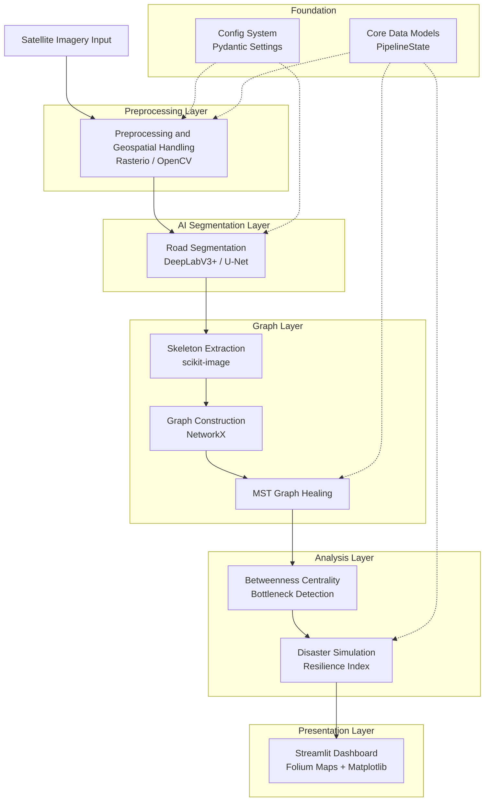
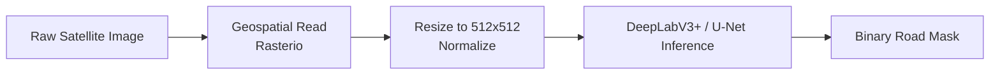
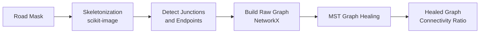
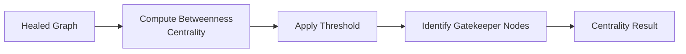
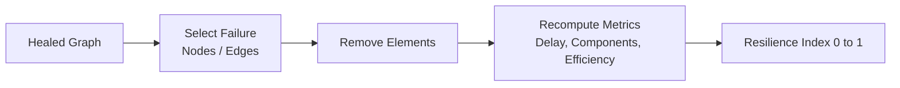
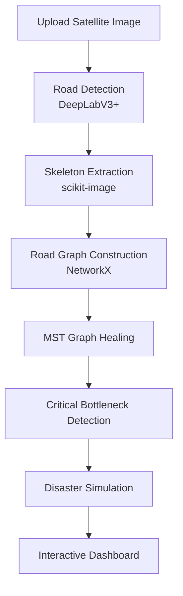

# Route Resilience

**AI-Powered Occlusion-Robust Road Extraction and Graph-Theoretic Urban Road Intelligence**

Built for the ISRO Bharatiya Antariksh Hackathon.

---

## Table of Contents

- [What is Route Resilience?](#what-is-route-resilience)
- [Problem Statement](#problem-statement)
- [Objectives](#objectives)
- [Our Solution](#our-solution)
- [Existing Solutions vs Our Solution](#existing-solutions-vs-our-solution)
- [System Architecture](#system-architecture)
- [Pipelines](#pipelines)
  - [Segmentation Pipeline](#1-segmentation-pipeline)
  - [Graph Reconstruction and Healing Pipeline](#2-graph-reconstruction-and-healing-pipeline)
  - [Centrality and Bottleneck Detection Pipeline](#3-centrality-and-bottleneck-detection-pipeline)
  - [Disaster Simulation and Resilience Pipeline](#4-disaster-simulation-and-resilience-pipeline)
  - [End-to-End Demo Pipeline](#5-end-to-end-demo-pipeline)
- [Demo Workflow](#demo-workflow)
- [Key Features](#key-features)
- [Target User Metrics](#target-user-metrics)
- [Uses of AI](#uses-of-ai)
- [Tech Stack](#tech-stack)
- [Project Structure](#project-structure)
- [Evaluation Metrics](#evaluation-metrics)
- [Dataset Setup](#dataset-setup)
- [Quick Setup](#quick-setup)

---

## What is Route Resilience?

Route Resilience is an end-to-end geospatial intelligence system that extracts road networks from satellite imagery, even when roads are partially hidden by trees, shadows, clouds, or vehicles. It converts the extracted roads into a topologically correct graph, repairs breaks caused by occlusion, and then analyzes the network for structural weak points. Finally, it simulates disaster scenarios such as node and edge failures to measure how resilient the road network is. The entire workflow is exposed through an interactive Streamlit dashboard with map-based visualization.

---

## Problem Statement

Automated road extraction from satellite imagery is a foundational task for urban planning, navigation, and disaster response, but three problems make it unreliable in practice.

First, **occlusion breaks detection**. Trees, building shadows, cloud cover, and vehicles hide portions of roads, so conventional segmentation models produce fragmented and disconnected outputs.

Second, **pixel masks are not networks**. A segmentation mask tells you where road pixels are, but it does not tell you how intersections, endpoints, and routes connect. Without a topologically correct graph, the output cannot support routing or network analysis.

Third, **no resilience insight**. Even when a road graph is produced, existing tools rarely answer the questions that matter for planners and emergency responders: which junctions are critical bottlenecks, and how badly does the network degrade when specific roads or intersections fail during a disaster.

Route Resilience addresses all three: robust extraction under occlusion, reconstruction into a healed graph, and quantitative resilience analysis.

---

## Objectives

- Extract road networks from satellite imagery with robustness to occlusion from trees, shadows, clouds, and vehicles.
- Convert segmentation masks into topologically correct road graphs with correct junction and endpoint structure.
- Heal fragmented graphs by reconnecting broken segments using minimum spanning tree based reconstruction.
- Identify critical bottleneck junctions using graph centrality measures.
- Quantify network robustness through disaster simulation and a composite Resilience Index.
- Deliver the full pipeline through an interactive, map-based dashboard usable by non-programmers.

---

## Our Solution

Route Resilience is a layered pipeline that moves from raw pixels to actionable resilience metrics.

Satellite imagery is first preprocessed and geo-referenced. A deep learning segmentation model (DeepLabV3+ or U-Net) produces an occlusion-robust road mask. The mask is skeletonized to a single-pixel-wide centerline, from which junctions and endpoints are detected and a road graph is constructed with NetworkX. Because occlusion leaves gaps, a minimum spanning tree healing step reconnects fragmented components into a single coherent network.

On the healed graph, betweenness centrality identifies gatekeeper nodes: the junctions whose removal most disrupts connectivity. A disaster simulation module then removes nodes or edges and recomputes travel delay, connected components, efficiency, and an overall Resilience Index. All stages are orchestrated through a shared pipeline state and surfaced in a multi-page Streamlit dashboard with Folium maps and Matplotlib renderings.

---

## Existing Solutions vs Our Solution

| Aspect | Conventional Approaches | Route Resilience |
|---|---|---|
| Occlusion handling | Fragmented masks where trees, shadows, and clouds hide roads | Occlusion-robust segmentation with graph healing to recover hidden connections |
| Output type | Pixel-level road mask only | Topologically correct road graph with junctions and endpoints |
| Connectivity | Broken, disconnected segments | MST-based healing reconnects components into one coherent network |
| Network analysis | Rarely provided | Betweenness centrality identifies critical bottleneck junctions |
| Resilience insight | Not addressed | Disaster simulation with a composite Resilience Index |
| Interpretability | Static outputs, code required | Interactive Streamlit dashboard with Folium maps |

---

## System Architecture



---

## Pipelines

### 1. Segmentation Pipeline

Transforms raw, geo-referenced imagery into an occlusion-robust binary road mask.



### 2. Graph Reconstruction and Healing Pipeline

Converts the road mask into a connected, topologically correct graph.



### 3. Centrality and Bottleneck Detection Pipeline

Identifies the junctions that are most critical to overall connectivity.



### 4. Disaster Simulation and Resilience Pipeline

Removes nodes or edges to measure how the network degrades under failure.



### 5. End-to-End Demo Pipeline

The complete flow from upload to interactive dashboard output.



---

## Demo Workflow

The demo runs entirely inside the Streamlit dashboard. Each step below shows the expected output. Place the corresponding screenshots in the `assets/demo/` folder using the filenames indicated.

**Step 1 — Upload satellite image.** The user uploads a satellite tile through the dashboard.


**Step 2 — Road detection.** The segmentation model produces an occlusion-robust road mask.


**Step 3 — Skeleton extraction.** The mask is reduced to single-pixel centerlines.


**Step 4 — Graph construction and healing.** Junctions and endpoints become a NetworkX graph, then MST healing reconnects fragments.


**Step 5 — Bottleneck detection.** Betweenness centrality highlights gatekeeper junctions.


**Step 6 — Disaster simulation.** Selected nodes or edges are removed and the Resilience Index is computed.


**Step 7 — Interactive dashboard.** Results are explored on Folium maps across the multi-page app.


---

## Key Features

| Feature | Description |
|---|---|
| Road Segmentation | DeepLabV3+ and U-Net wrappers with occlusion robustness |
| Graph Reconstruction | Skeleton to graph to MST healing for connected networks |
| Bottleneck Detection | Betweenness centrality with gatekeeper node identification |
| Disaster Simulation | Node and edge failure driving a composite Resilience Index |
| Interactive Dashboard | Multi-page Streamlit app with Folium maps |
| Dataset Support | SpaceNet, DeepGlobe, OpenSatMap, and OSM loaders |

---

## Target User Metrics

| User | Primary Need | Value Metric |
|---|---|---|
| Urban Planners | Reliable road network maps from imagery | Network coverage and connectivity ratio |
| Disaster Response Agencies | Identify critical junctions before a crisis | Resilience Index and bottleneck count |
| Geospatial and ISRO Analysts | Topologically correct extraction at scale | Topological accuracy and time saved vs manual mapping |
| Infrastructure Engineers | Understand failure impact on routing | Travel delay and efficiency under simulated failure |

---

## Uses of AI

- **Deep learning semantic segmentation.** DeepLabV3+ and U-Net models classify road versus non-road pixels from satellite imagery.
- **Occlusion-robust inference.** The segmentation stage is designed to recover road pixels partially hidden by trees, shadows, clouds, and vehicles.
- **Learned feature extraction.** Convolutional backbones extract multi-scale spatial features that generalize across varied urban and rural scenes.

The stages that follow segmentation are deterministic and algorithmic rather than learned: skeletonization, graph construction, MST healing, centrality analysis, and disaster simulation are classical graph-theoretic and image-processing methods. This separation keeps the AI outputs interpretable and the network analysis reproducible.

---

## Tech Stack

| Category | Technologies |
|---|---|
| Language | Python |
| Deep Learning | PyTorch (DeepLabV3+, U-Net) |
| Graph Analysis | NetworkX |
| Geospatial | Rasterio, GDAL |
| Computer Vision | OpenCV, scikit-image |
| Scientific Computing | NumPy, SciPy, pandas |
| Visualization and Dashboard | Streamlit, Folium, Matplotlib |
| Configuration and Validation | Pydantic, PyYAML |

---

## Project Structure

```
Route-Resilience/
├── analysis/           Centrality analysis and disaster simulation
├── config/             Pydantic configuration system
├── core/               Interfaces and data models (PipelineState)
├── dashboard/          Streamlit dashboard (app.py)
├── datasets/           Dataset loaders and factory
├── graph/              Skeleton extraction, graph building, healing
├── preprocessing/      Image preprocessing and geospatial handling
├── segmentation/       DeepLabV3+ and U-Net wrappers
├── utils/              Error classes and utilities
├── visualization/      Matplotlib graph rendering
├── packages.txt        System dependencies (GDAL)
└── requirements.txt    Python dependencies
```

---

## Evaluation Metrics

| Metric | Description |
|---|---|
| IoU | Intersection over Union of predicted and ground-truth road masks |
| Dice Score | F1-like overlap metric between prediction and ground truth |
| Relaxed IoU | IoU with a 3 to 5 pixel tolerance buffer |
| Connectivity Ratio | Largest connected component size divided by total nodes |
| Topological Accuracy | Average path length error versus OSM reference |
| Resilience Index | Composite robustness score in the range 0 to 1 |

---

## Dataset Setup

Detailed setup instructions are available on the Dataset Info page inside the dashboard. Supported datasets:

- **SpaceNet Roads** — https://spacenet.ai/roads/
- **DeepGlobe Road Extraction** — https://competitions.codalab.org/competitions/18467
- **OpenSatMap** — https://opensatmap.github.io/
- **OpenStreetMap (OSM)** — auto-fetched via OSMnx

Download the dataset of your choice, place it in the location described on the dashboard Dataset Info page, and select it through the dataset loader.

---

## Quick Setup

```bash
# 1. Clone the repository
git clone https://github.com/jayjit-2025/Route-Resilience.git
cd Route-Resilience

# 2. Install system dependencies (GDAL)
#    On Debian/Ubuntu:
sudo apt-get update && sudo apt-get install -y libgdal-dev gdal-bin

# 3. Install Python dependencies
pip install -r requirements.txt

# 4. Run the dashboard
python -m streamlit run dashboard/app.py
```

Open http://localhost:8501 in your browser.

---

Built for the ISRO Bharatiya Antariksh Hackathon 2025.
